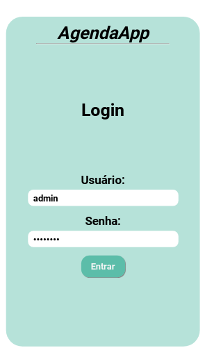
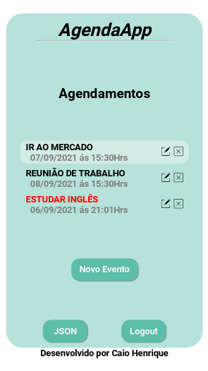
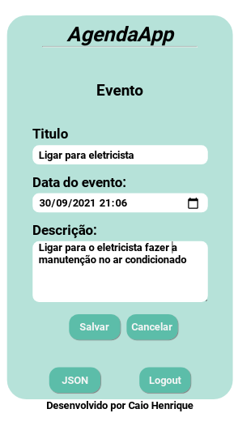
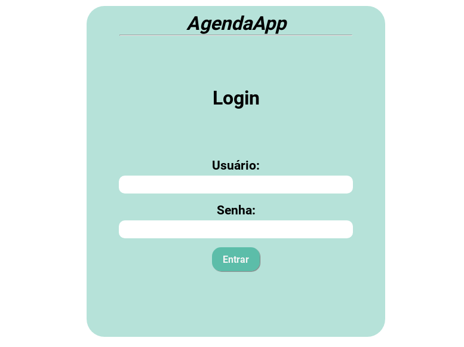
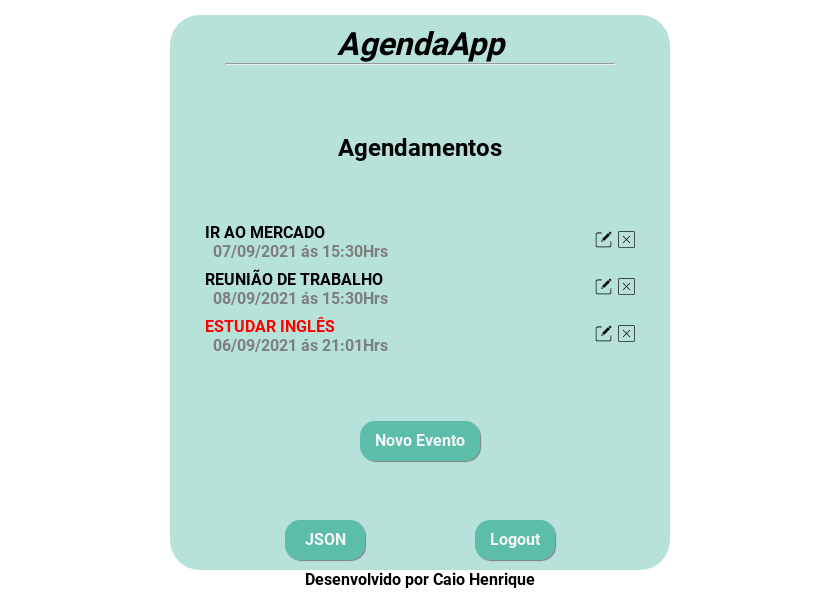
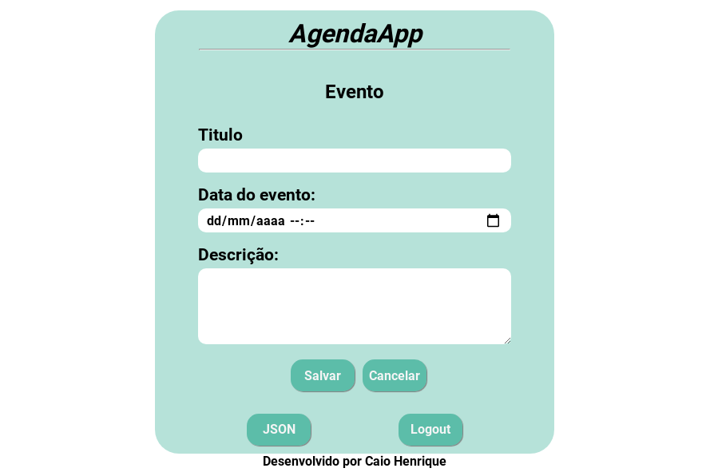

# AgendaApp
Aplicativo de agenda em python

<h1 align="center">Agenda</h1>

<h2 align="center">Agende eventos para ficar por dentro das suas tarefas.</h2>

 

<h1 align="center">Mobile Version</h1>

  
  
  

 

<h1 align="center">Web responsive Version </h1>

  

  

  

 

 
  <h2 align="center">FEATURES :book:</h2>
 

- **Python**
- Framework **Django**
- Banco de dados Django admin
- Sistema de migrations para controle de criação do banco
- Sistema de logins
- Sistema de autenticação
- Métodos http para responses
- Filtros de dados
- Configurações e permissões de usuário
- **HTML5** 		
- **CSS3** 	    

 
  <h2 align="center">RECURSOS</h2>
 
 - Usuário
   - Fazer login e logout
   - Cadastrar usuário
   - Editar usuário
   - Excluir usuário
 - Eventos
   - Adicionar evento
   - Ver proximos eventos
   - Ver eventos com até 60 minutos de atraso
   - Editar eventos
   - Excluir eventos
   - Gerar JSON dos eventos

 